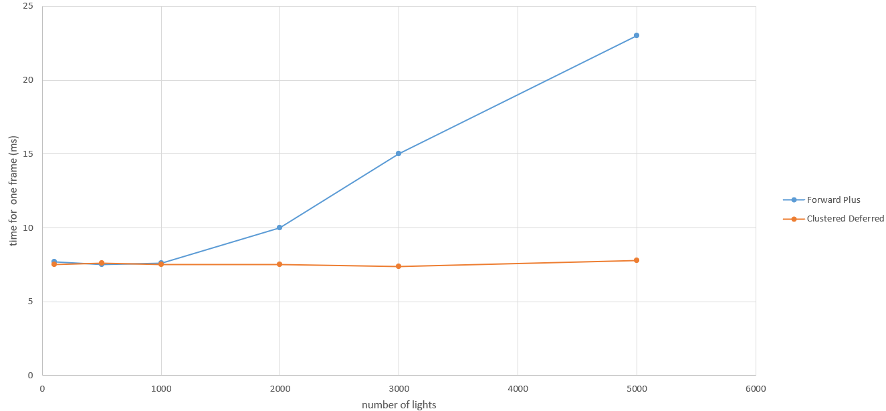
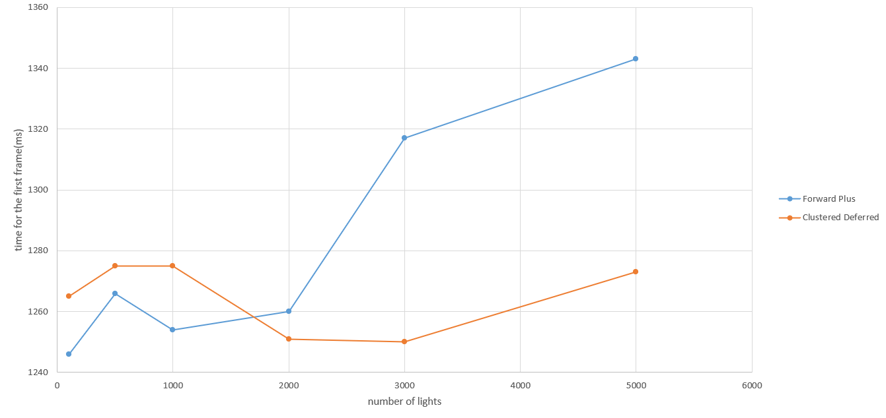
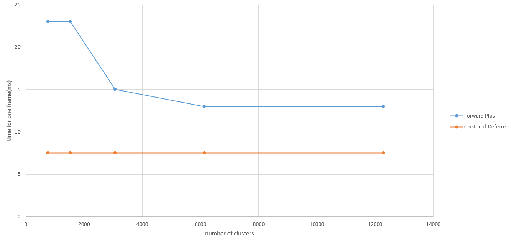
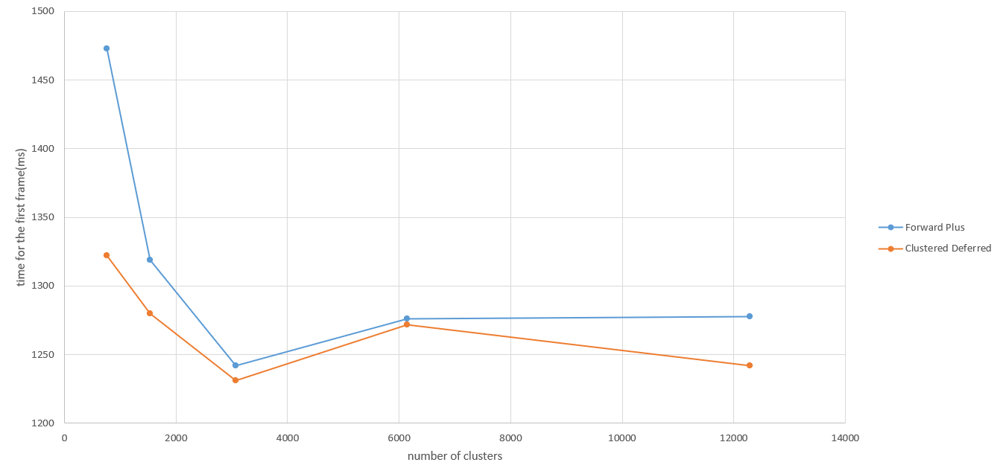

WebGL Forward+ and Clustered Deferred Shading
======================

**University of Pennsylvania, CIS 565: GPU Programming and Architecture, Project 4**

* Yuning Wen
* Tested on: **Edge - Version 141.0.3537.71 (Official build) (64-bit)** on
  Windows 11, i9-12900H @ 2.50GHz 16GB, NVIDIA GeForce RTX 3060 Laptop GPU (Personal Laptop)

### Live Demo

### Demo Video/GIF

### README

This project is about rendering with multiple lights using WebGPU. After a naive implementation, I have also finished Forward Plus and Clustered Deferred to improve the performance.

The Forward Plus creates tile for each cluster of pixels and records and computes only the lights that interact with that tile. I have also slices on the z-axis to create clusters to record lights in 3D clusters, and loop only through the lights that affect the cluster in the corresponding fragment shader.

The Clustered Deferred still uses the clustering logic, but also includes G-Buffer to get all the information about position, normal, and albedo for each pixel. Thus when calculating the final color of the pixel, the fragment shader may directly use the data within the G-Buffer and then loop through the lights that affect the cluster.

### Performance Analysis

**In general**, Clustered Deferred performs better than Forward Plus with cluster only especially when the number of lights gets large. I believe that loading g-buffer really helps a lot for Clustered Deferred, while it does use extra space as buffer to load all the information needed.

To be more specific, here are some data to show the differece between the two features. The two charts below are collected with $512$ as maximum number of lights in each cluster, in total $16 \times 8 \times 24 = 3072$ clusters, and workgroup size $8 \times 8 \times 4$.

In this graph, we may see that as the number of lights increases. the average time for one frame gradually increases for Forward Plus, but not really change for Clustered Deferred. Since I have setted $5000$ as the maximum number of total lights, I currently may not predict how the time for one frame will change with lights more than $5000$ for Clustered Deferred.

This data shows the time of generating the first frame with the same condition above and only change the number of lights. The data also shows that the Forward Plus takes longer time for its first frame, while Clustered Deferred uses similar time for the first frame with different number of lights.

Besides changing the number of lights, I have also fixed the number of lights at $3000$. By also keeping $512$ as maximum number of lights in each cluster and workgroup size $8 \times 8 \times 4$, the two charts below shows the performance changes with different number of clusters.

This chart shows the average time for one frame changes with different number of clusters. While the Forward Plus one has high time for one frame with small number of clusters and gradually decreases the average time as the number of clusters increases, the Clustered Deferred one has no significant changes.

The chart above shows the time for generating the first frame with different number of clusters. We may see that when the number of clusters are small, both features takes longer time to generate the first frame. As the number of clusters increases, the time to generate the first frame also decreases.

In conclusion, it seems like both trends may perform better with less number of lights and more number of clusters. For these two parameters only, if they go the other way, the performance may also get worse.

### Credits

- [Vite](https://vitejs.dev/)
- [loaders.gl](https://loaders.gl/)
- [dat.GUI](https://github.com/dataarts/dat.gui)
- [stats.js](https://github.com/mrdoob/stats.js)
- [wgpu-matrix](https://github.com/greggman/wgpu-matrix)
